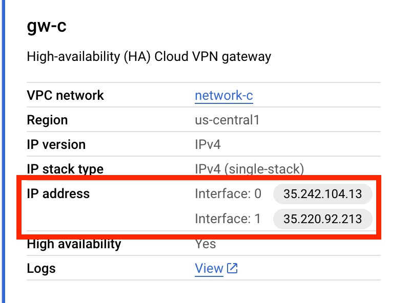

# Three way vpn tunnel

## Keeping it simple

I'm going to create the projects and associated state bucket manually, and then initialize tf to use the bucket. That way the projects will aready exist and I can just run the terraform code to create the networks, gateways, routers, tunnels, and configure BGP sessions.

- Create three different networks in three separate projects: A,B,C
- join ProjA/NetworkA to ProjB/NetworkB using VPN tunnel
- join ProjB/NetworkB to ProjC/NetworkC using VPN tunnel

A <-> B <-> C

Each project gets one gateway, and one router.
Each network gets one subnet.

## Lessons LEarned

### Link Local Addresses and BGP IPs
On either end of the tunnel is a BGP router, and its associated BGP peer.
Suppose we have Tunnel A and Tunnel B
- Tunnel A has a BGP router with a link local address of X. Its peer BGP is at address Y
- Tunnel B has a BGP router with a link local address of Y. Its peer BGP is at address X

X and Y must be within the link local address range, and be within the same `/30` block. 

For example, if Tunnel A's BGP ip is 169.254.3.1, then Tunnel B's BGP ip must be within the `169.254.3.1/30` block - that is: 
`169.254.3.0, 169.254.3.1, 169.254.3.2, 169.254.3.3`

### VPN Gateway Address Interface Indices

When creating a VPN tunnel, you must specify the interface index of the gateway that the tunnel is connecting to. These interfaces are ip addresses. This is the `vpn_gateway_interface` field in the `google_compute_vpn_tunnel` resource. You can find thes indices in the console when you inspect the gateway; for example:

# Docs
- https://cloud.google.com/network-connectivity/docs/vpn/how-to/automate-vpn-setup-with-terraform
